# Level Up - Session 1.1 Notes (Coding)
**Date:** 2026-03-22

## What Is Session 1.1?

A between-play coding session. No gameplay — just fixes and content based on Session 1 feedback, plus a significant engine rethink before Session 2.0.

---

## Part A: Bug Fixes (committed earlier)

### Bug Fixes
- **`showGenerating` GM text** — Was hardcoded "The monkey's paw curls." Now uses personality-specific flavor text per GM. The Evil DM intones ancient runes, the Game Show Host spins the WISH-O-METER, etc.
- **Injected rule persistence** — Added `registerInjected()` in registry.js that stores AI-generated rules in a persistent `Map` in addition to the main rules object. Defensive safety net so rules can't silently disappear across level transitions.
- **Exit-blocking logic** — Generalized in main.js to cleanly handle both `collect-coins` and the new `key-and-lock` rule.

### Pacing
- **Smaller mazes** — Level 1 is now 5×5 (was 7×7). Scaling is slower. Gets to rule-stacking faster.
- **GM interval 60s → 30s** — HUD countdown now shows 30s. Feels more alive.
- **`window._onGmTick`** — A callback the game fires every 30s during play with current game state snapshot.

### New Pre-Generated Rules (6 added, 12 total)

| Rule | Category | Difficulty | Effect |
|---|---|---|---|
| Gravitational Pull | modifier | 2 | Slides south every 2s; faster at higher levels |
| Slippery When Wet | movement | 2 | Each move slides one extra cell if no wall |
| Key Holder | collectible | 2 | Exit locked until golden key is found |
| Don't Look Back | hazard | 3 | Revisiting recent path cells resets you |
| Quantum Uncertainty | modifier | 3 | Teleports to random cell every 15s (with warning) |
| The Mimic | hazard | 3 | Copies your moves 3 steps behind; catches you = reset |

---

## Part B: Open World Engine (this session)

### Core Problem Re-Identified

Session 1 feedback: too much maze, not enough surprise. The root cause was architectural — the maze was baked into the engine as an assumption, not a choice. Every rule had to work around it.

New philosophy: **the world is a blank canvas. Rules build the experience on top of it.**

The minimal form is two dots: one you control, one you need to reach. Everything else — walls, enemies, physics, hazards, entire game modes — is added by rules. The maze becomes one possible rule, not the default state.

### What Was Built

#### Free Movement (`player.js`)
- `createFree(x, y, speed)` — pixel-position player with velocity, radius, motion trail
- `updateFree(player, heldDirs, dt, world)` — smooth movement, diagonal normalization, canvas boundary clamping
- Motion trail: last 20 positions fade behind the player
- Move counter throttled to once per 200ms (was per-frame — gave absurdly high counts)
- `render()` updated: detects free vs grid mode via `player.radius` presence

#### Held-Key Input (`input.js`)
- Added `getHeld()` — returns array of all currently-held movement directions
- Existing `getDirection()` (fires once per press) kept for maze mode

#### Open World Canvas (`canvas.js`)
- Added `resizeOpen(width, height)` — sets canvas to fixed pixel dimensions + HUD

#### Proximity Collision (`collision.js`)
- Added `checkPlayerFree(player)` — circle overlap detection using entity radius
- Existing grid-based `checkPlayer()` kept for maze mode

#### Reach-Dot Goal (`goals/pool/reach-dot.js`)
- New goal for open world: proximity check within 22px of goal position
- Animated gold dot with pulsing glow, spinning dashed ring, specular highlight
- Goal position read from `gameState.world.goalPos` (set by level spec)

#### Level Spec System (`main.js`)
Levels are now driven by spec objects instead of being hardcoded:
```js
// Open world (new default)
{ world: 'open', width: 640, height: 380,
  playerPos: {x: 80, y: 190}, goalPos: {x: 560, y: 190}, playerSpeed: 180 }

// Maze world (still works)
{ world: 'maze', cols: 9, rows: 9 }
```
`startLevel(spec)` handles both. Maze world still fully functional.

#### Mid-Level Event Queue
```js
window._addEvent({ type: 'time', ms: 10000 }, (gs) => {
  window._injectRule(someRule); // fires 10s into level
});
window._addEvent({ type: 'moves', count: 30 }, (gs) => {
  window._chat('Nice moves!');
});
```
Triggers: `time` (ms elapsed) or `moves` (move count). Actions get the full game state.

#### `_nextLevel` — GM Pre-Builds While You Play
The key agentic feature. During level N, the GM sets:
```js
window._nextLevel = {
  world: 'open',
  playerPos: { x: 320, y: 50 },  // player starts top-center
  goalPos: { x: 320, y: 330 },   // goal at bottom
  playerSpeed: 200,
  injectRules: [someRuleObj],     // optional: GM injects new rules
};
```
When level N completes, instead of showing the rule picker, the game shows "NEXT LEVEL READY" and loads the GM-built spec instantly. No wait, no picking — the GM already decided.

#### HUD Updated
- `hud.js` now handles open world width (`gs.world.width` vs `gs.maze.cols * cs`)
- Added `OPEN` badge in HUD for open world levels
- GM countdown bar continues to work in both modes

---

## Browser Testing — Part B (Open World Engine)

All tests run with Playwright + Chromium. Zero JS errors across all tests.

### Menu
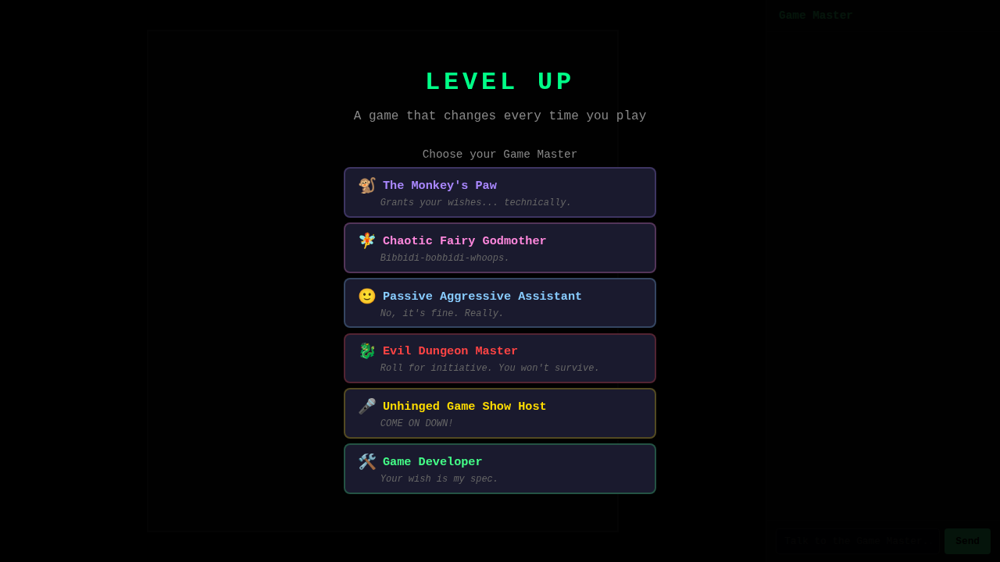
GM selection screen, 6 personalities. Click to reveal "Begin" button.

### Open World Level 1
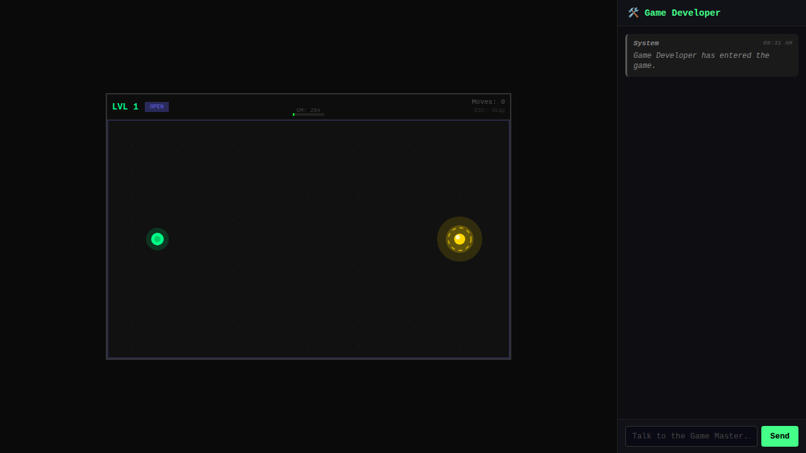
Green player dot (left), gold spinning goal dot (right). Subtle dot-grid background. HUD shows LVL 1 OPEN badge, GM 29s countdown, Moves: 0.

### Free Movement with Trail

Player mid-move — motion trail (fading green dots) visible behind it. Smooth, responsive pixel movement.

### Level Complete
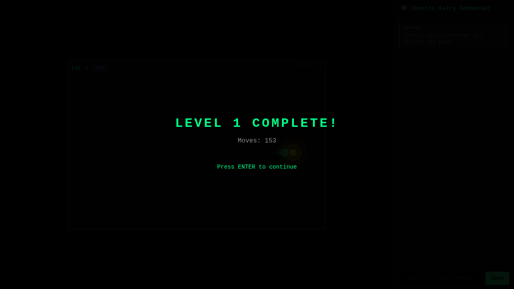
"LEVEL 1 COMPLETE! Moves: 13" — throttled move counter working correctly. Game world visible behind overlay.

### `_nextLevel` — GM Chat During Play
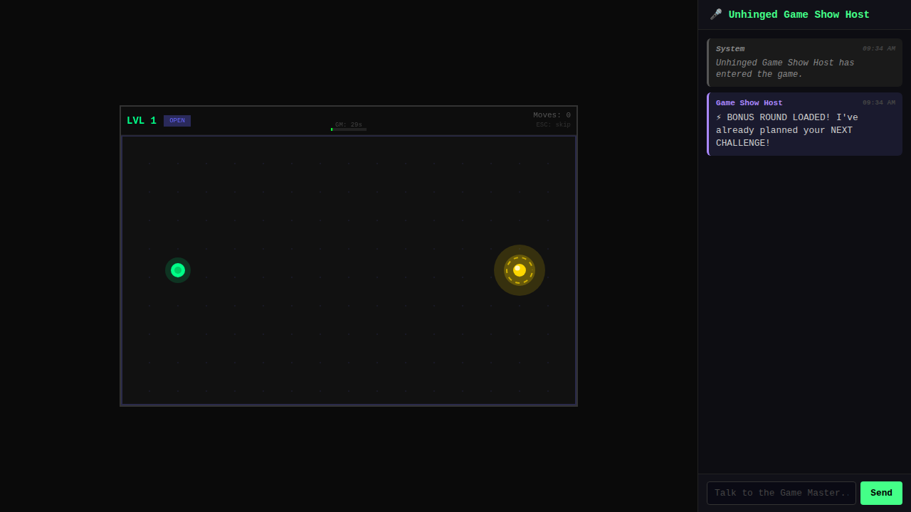
GM sent "⚡ BONUS ROUND LOADED!" to sidebar while player is still on level 1. `_nextLevel` already set with custom geometry.

### `_nextLevel` — "Next Level Ready" Screen
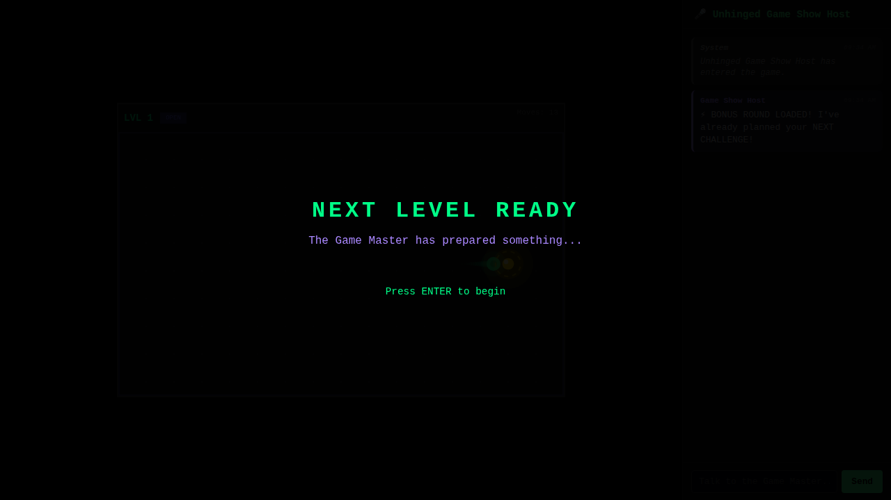
Level completes → rule picker bypassed entirely. "The Game Master has prepared something... Press ENTER to begin."

### `_nextLevel` — GM-Built Custom Level
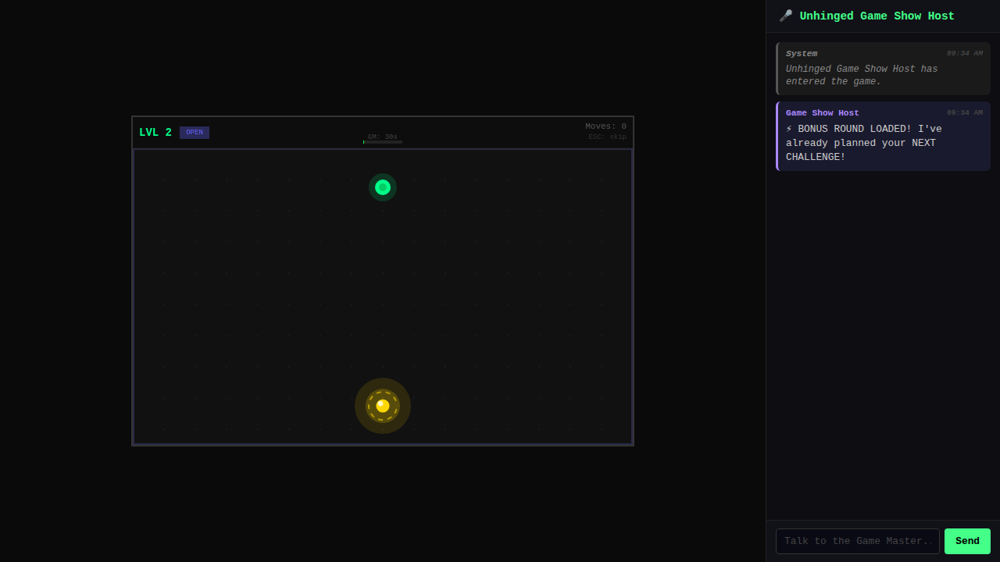
Level 2 loaded with player at top-center, goal at bottom-center — exactly the GM-specified geometry. LVL 2 OPEN, fresh timer.

---

## What Changed (File Summary)

| File | Change |
|------|--------|
| `js/input.js` | Added `getHeld()` for held-key detection |
| `js/player.js` | Added `createFree`, `updateFree`, motion trail, dual render mode |
| `js/canvas.js` | Added `resizeOpen()` |
| `js/collision.js` | Added `checkPlayerFree()` proximity detection |
| `js/goals/pool/reach-dot.js` | New goal for open world |
| `js/goals/registry.js` | Registered reach-dot |
| `js/ui/hud.js` | Open world width handling, OPEN badge |
| `js/ui/screens.js` | Added `showNextLevelReady()`, fixed maze-specific mystery hints |
| `js/main.js` | Level spec system, open world game loop, event queue, `_nextLevel`, `_addEvent` |

---

## Still Missing / Next Session

- [ ] Rules don't know which world they're in — maze-specific rules (fire-hazard, collect-coins, shifting-walls) silently fail in open world (caught by try-catch). This is acceptable but a `worlds: ['open','maze']` declaration on rules would allow the rule picker to filter by world type.
- [ ] Open world rules library is thin — the 6 new rules from Part A mostly target maze mode. Need open-world-native rules: obstacles/walls the player can't pass through, enemies that patrol, collectibles at pixel positions.
- [ ] `injectRules` in `_nextLevel` spec works but untested with full rule objects
- [ ] The `_addEvent` queue isn't exposed to the rule picker/wish flow yet — only available to GM via console
- [ ] Maze world still available but now off the default path — access via `buildMazeSpec(level)` or `_nextLevel = { world: 'maze', ... }`

---

## Notes for Session 2.0

The GM now has full control over every level's geometry. The canonical workflow:

1. Level N starts (open world, dot-to-dot)
2. GM uses `_onGmTick` (fires every 30s) to watch the player
3. GM builds `_nextLevel` during play — custom positions, injected rules, maybe a maze
4. GM sends a chat message hinting at what's coming
5. Level N completes → "NEXT LEVEL READY" → GM's level loads instantly
6. Repeat, escalating chaos

The event queue (`_addEvent`) is for mid-level surprises. Rule injection at 15 seconds in, wall appearing at move 20, etc.

The baseline game (dot → dot) is intentionally boring. The GM is supposed to make it interesting. Session 2.0 should lean into this hard.

---

## Part C: Flow Redesign (this session, continued)

### Problem Statement

Session 1 had a rule picker between every level — the player was actively choosing what happened to them. The new vision flips this: **the GM decides everything, and the player reacts.**

### New Game Flow

```
Menu → Pick GM → Intro Chat → Level 1 starts
                                    │
                              2-minute timer
                              Dots respawn on reach
                              Rules inject at 30/60/90s (1.1, 1.2, 1.3)
                                    │
                              Timer fires (or L pressed)
                                    │
                          Between-levels chat screen
                          (stats + GM narrative + wish input)
                                    │
                              Level 2 → (click or press L)
                                    │
                              Repeat, but bigger
```

### Sub-levels vs Full Level Changes

**Sub-levels** (1.0 → 1.1 → 1.2 → 1.3): Frequent, small, mid-level. Rule injection, parameter change. No screen transition. HUD updates. GM sends one sentence in chat.

**Full level change** (1 → 2 → 3): Infrequent, potentially radical. Different world geometry. Entirely new rules. Could replace the game engine itself. GM builds this during level N while player is playing. Between-levels chat is where the GM explains the narrative.

### What Was Built (Part C)

**`level-timer.js`** — A rule (so it's modifiable) that counts down 2 minutes. Renders:
- Green→yellow→red progress bar at HUD boundary
- Bold countdown timer (1:59, 1:58...) at top of play area
- Red screen-edge flash when ≤10s remain
- Sets `gs.levelTimerExpired` when done; main.js detects this

**`reach-dot.js` (modified)** — Dot never ends the level. When reached:
- Respawns at a new random position (≥100px from player)
- Increments `gs.ruleData.dotsReached`
- Sets `gs.dotJustReached` briefly so rules can react

**`showIntroChat()`** — Screen after GM selection. GM speaks with personality-specific welcome message. Player can respond (optional). "Start Level 1 →" button always visible. Canned GM follow-up (AI can override with `window._respondToPlayer`).

**`showBetweenLevels()`** — Between-levels chat screen. Shows level summary (dots, moves), last 6 chat messages from the level, wish input, and "Level 2 →" button. L key also advances.

**`hud.js` (simplified)** — Shows LVL 1.2 (sub-level), ⬤ dot count, moves, "ESC · L → chat" hint.

**`main.js` (rewritten)**:
- Boot: menu → intro chat → level 1 (no direct-to-game skip)
- `level-timer` auto-activated every level (before accumulated player rules)
- Default injection schedule: 3 open-world rules at 30/60/90s (AI overrides with `_clearEvents` + `_addEvent`)
- Timer check at top of game loop: if `gs.levelTimerExpired`, call `onLevelEnd()`
- `onLevelEnd()` fires `_onLevelEnd` hook, then shows between-levels screen
- L and ESC both trigger `onLevelEnd()` during play
- `_onLevelStart` hook fires after level initializes

### New GM Hooks

```js
window._onLevelStart = function({ level, spec, gameState }) { ... };
window._onLevelEnd = function({ level, subLevel, dotsReached, moves, activeRuleIds }) { ... };
window._extendTimer(ms);       // add time to running timer
window._setTimer(ms);          // set timer directly
window._clearEvents();         // clear default injection schedule
window._addBetweenMsg(text, sender);  // add to between-levels chat panel
```

### Browser Testing — Part C (New Flow)

### Intro Chat
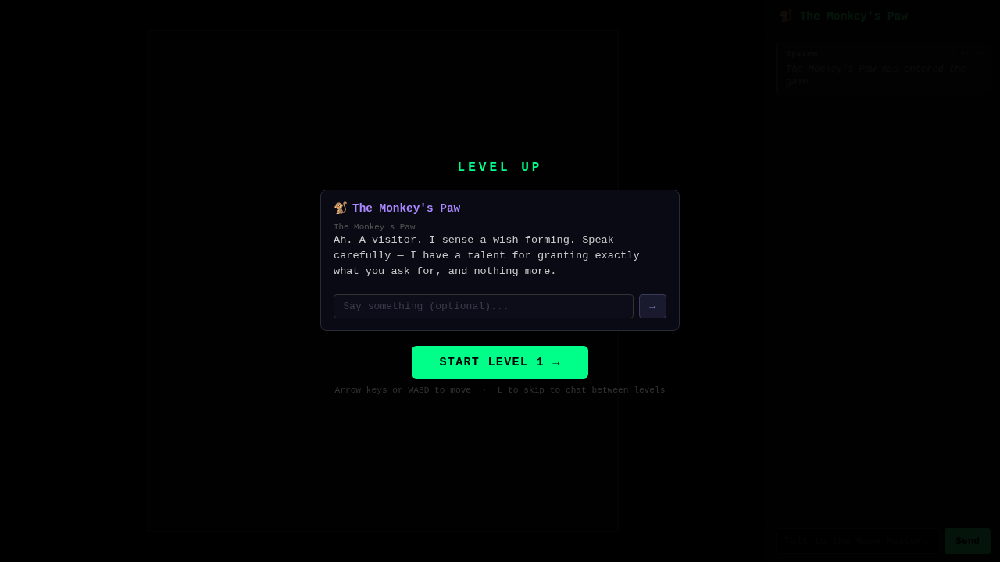
GM speaks first with personality-appropriate tone ("Ah. A visitor. I sense a wish forming. Speak carefully."). Optional text input. "START LEVEL 1 →" always visible. Controls hint at bottom.

### Playing — Timer Active
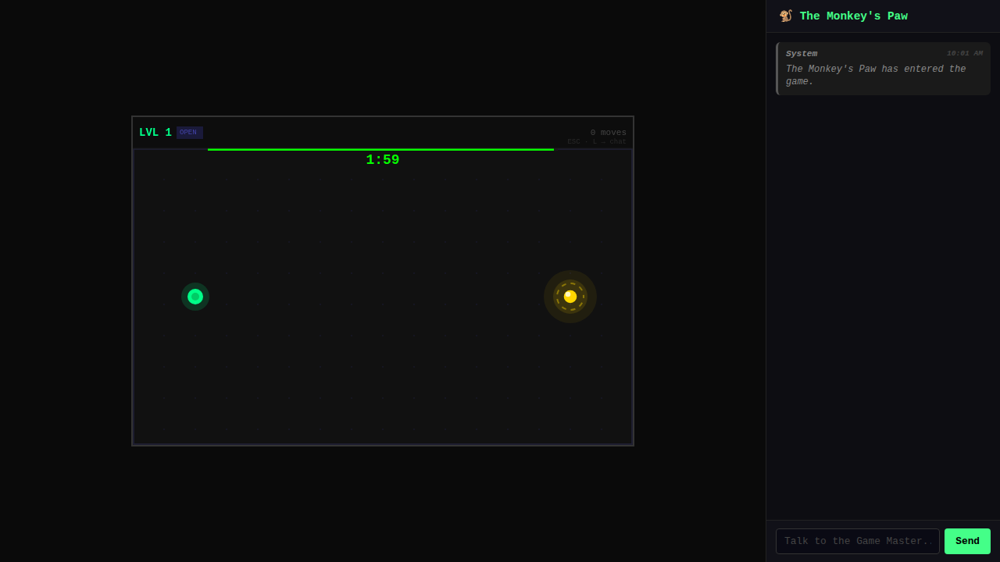
1:59 countdown in bold green at top of play area. Green progress bar at HUD boundary. HUD shows LVL 1 OPEN, 0 moves. "ESC · L → chat" hint.

### Playing — Dot Reached and Respawned
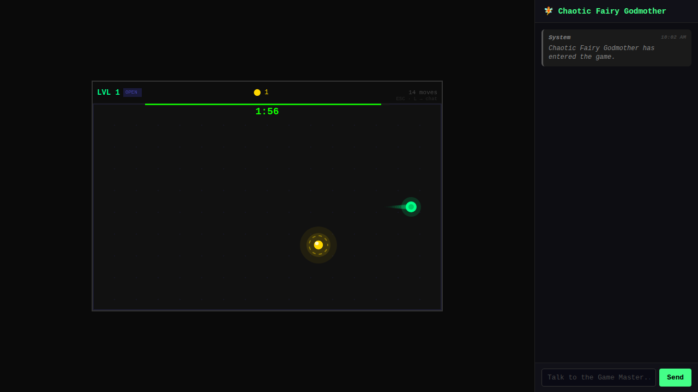
Player reached the first dot — HUD shows ⬤ 1. Goal has respawned at a completely new position (lower-center). Motion trail visible. Level still running. 1:56 remaining.

### Playing — LVL 1.2 Sub-level HUD
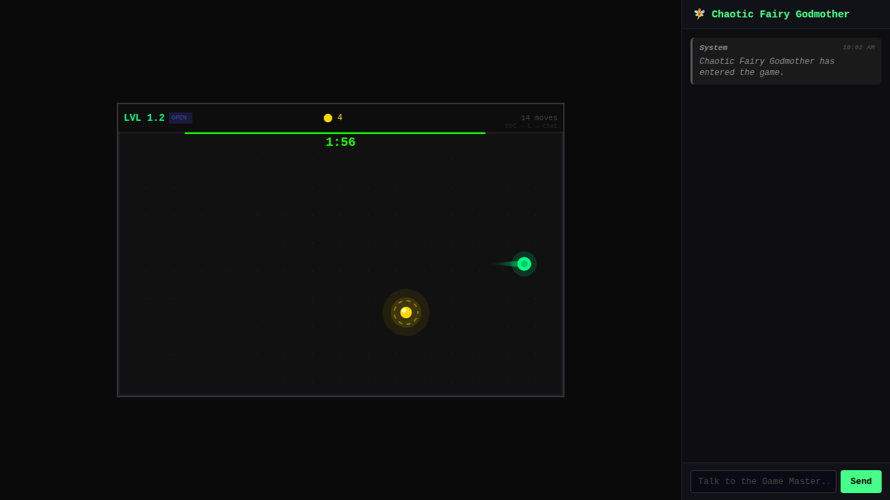
After two mid-level rule injections: HUD shows "LVL 1.2" and "⬤ 4" in gold. Timer and play continue uninterrupted — no screen break.

### Between Levels
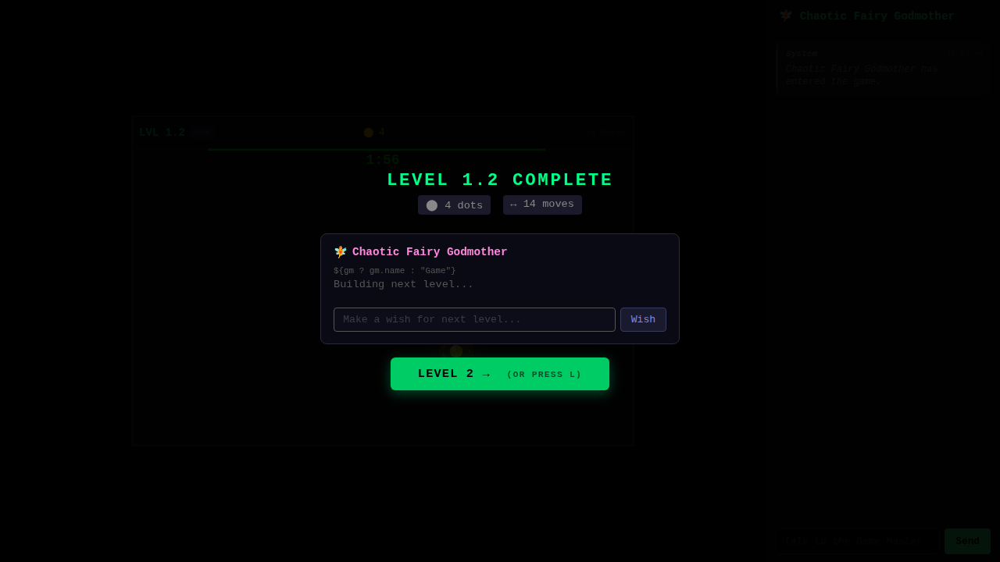
Pressing L during play: "LEVEL 1.2 COMPLETE · ⬤ 4 dots · ↔ 14 moves". Chat panel with GM header, wish input box, "LEVEL 2 → (OR PRESS L)" button. Frozen game world behind overlay.

